## Q1

The address is 1000D02E

## Q2

data section / 100163CC address

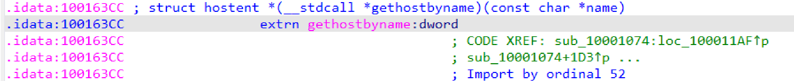

## Q3

5 functions calls gethostbyname

## Q4

The DNS is pics.praticalmalwareanalysis.com

 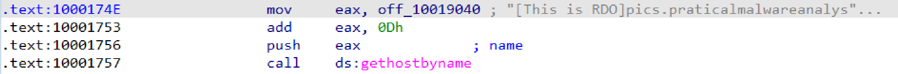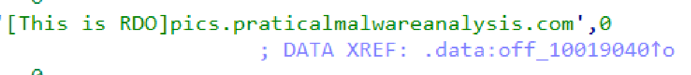

## Q5

there are 23 local variables

 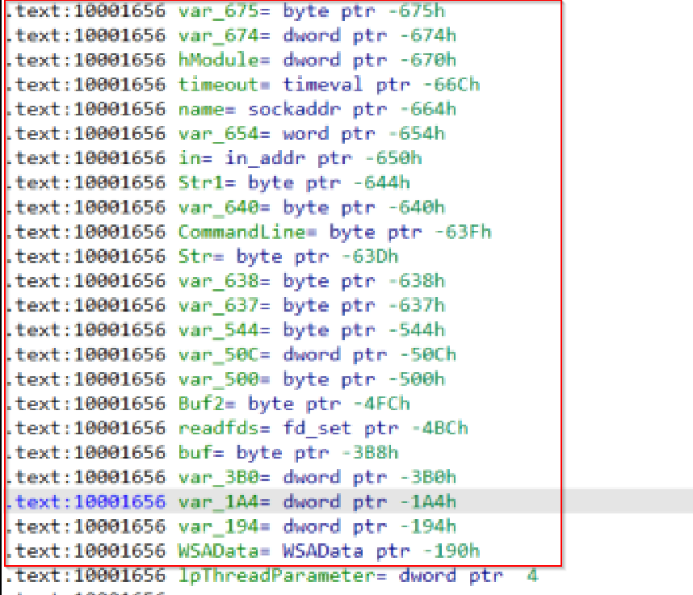

## Q6

there is 1 parameter 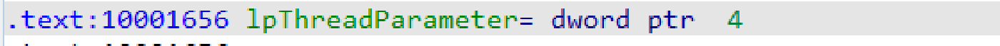

## Q7

the string in the strings window
it is located in loc_10010107: func. the address is 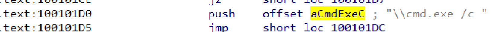

## Q8

- here 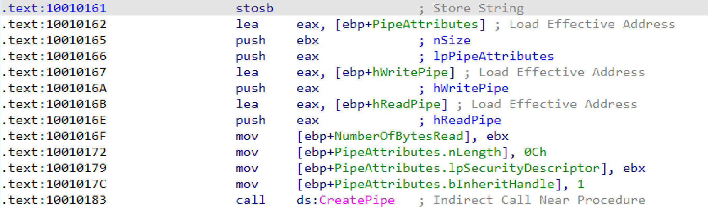there is a call for CreatePipe func it neeads two operands  read and write operands.

- also we have 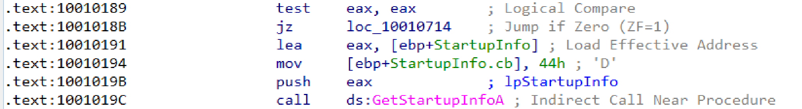. therer is another call that needs another parameter that stored in eax.

- the last call is the Windows API function is GetSystemDirectoryA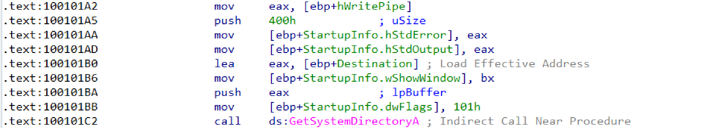 it takes teo operants r 1- A pointer to a buffer that will receive the path of the system directory.
2- The length of the buffer in character

so i think it is creating info in the exe fie or downloading it in the system

## Q9

- first thing i am giong to the location of the ip address  then we shhould press x to get xrefs 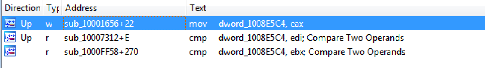 to know how does the malware set we should go into first choice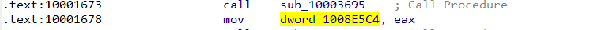we will see that eax was moved to the func and eax came from the call sub_10003695 so  we should step into it.
- this function gets info about the operating system version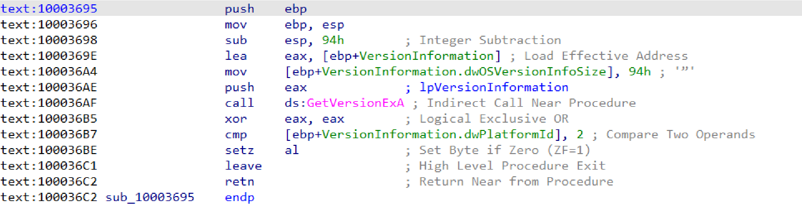

## Q10 

i searched for robotwork and i found  this 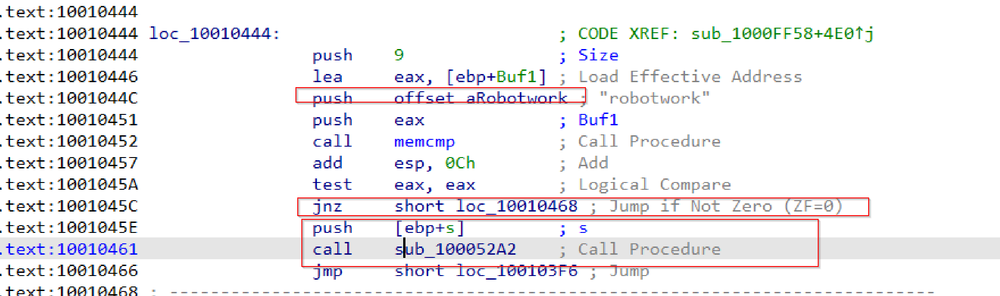 when ZF is 0 it will call sub_100052a2 that pushes 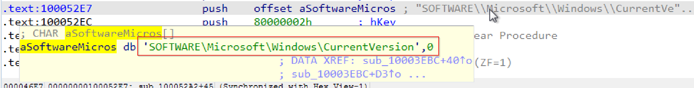

## Q11 

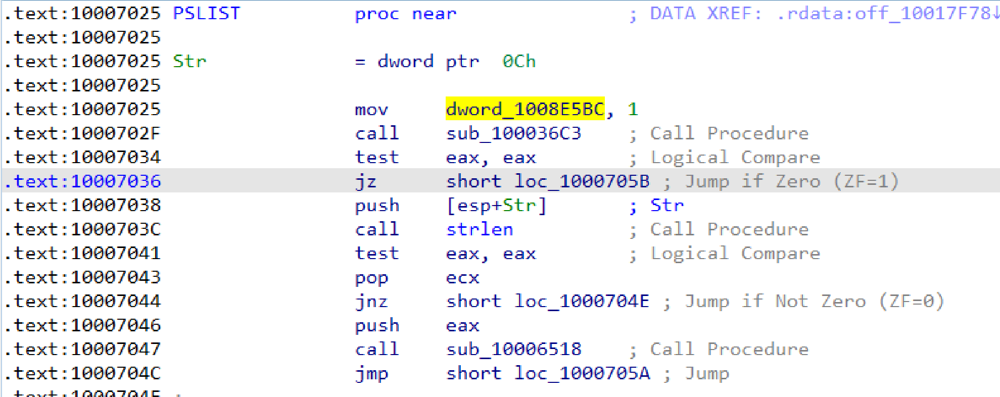 we can see that it calles sub_100036c3 when we step into it we will find that this export is trying to get info about the version of the system 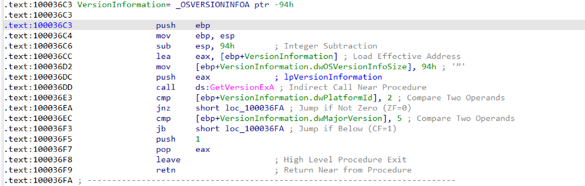

## Q12

2 api functions which r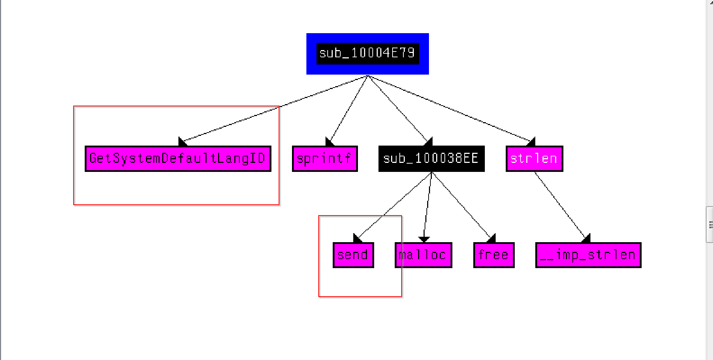i think it should be Send_SysLanguage

## Q 13

1 API  functions 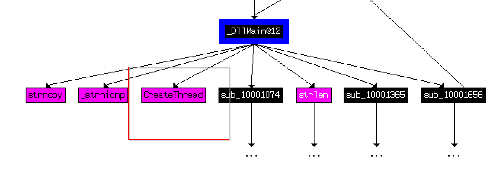. there are many funcs in depth2

## Q14

it will be 1000(3e8h) * 30 = 30000 ms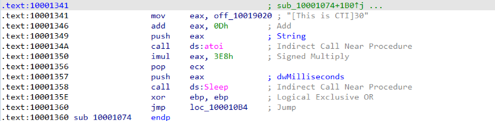

## Q15

6, 1 and 2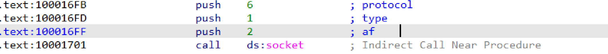

## Q16

i copied it from the answers because there were many sympols and i was not able to choose.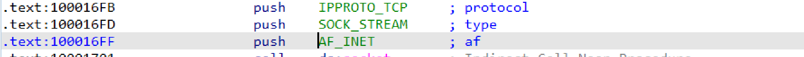

## Q17

yes it was used 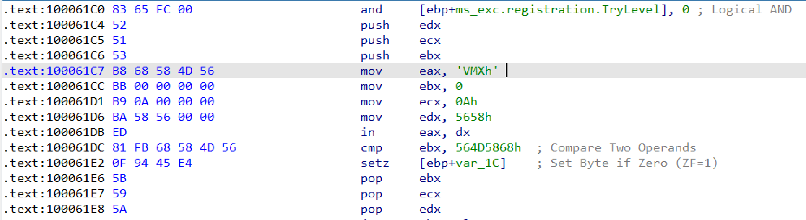, i can not find any thing

## Q18

i see data 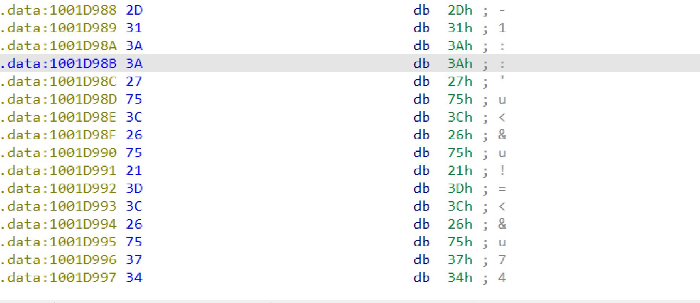

## Q19

## Q20

## Q21